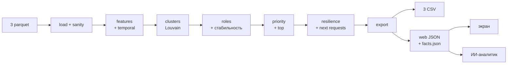

# CLAUDE.md — «Грибница» · HackAlem AI · кейс «Граф денег»

> Единственный источник правды для Claude Code в этом репозитории. Прочитай целиком перед первой задачей.
> Если задача противоречит этому файлу, остановись и спроси человека. Этот файл меняет только владелец
> пайплайна (см. §17), с объявлением команде.

---

## 0. Коротко

- **Продукт:** «Грибница» (Mycelium) — инструмент AML-аналитика банка. По графу переводов от 81 известного
  курьера восстанавливает структуру группы: роль каждого узла, кластеры, ранжированный список «кого смотреть
  первым» с обоснованием.
- **Метафора для питча:** банк срывает грибы (курьеров), а они вырастают снова. Мы показываем грибницу —
  сеть, на которой они растут.
- **Главный критерий жюри:** любой gid объясняется за минуту, опираясь на наши метрики. Считаем только то,
  что можем защитить.
- **Сдача:** 18:00 по Астане фиксируется содержимое репозитория. **Финальный коммит — не позже 17:45.**
- **Две команды:**
  ```bash
  python -m mycelium.pipeline      # parquet → out/*.csv + out/web/*.json + out/facts.json  (цель: < 60 с)
  python -m mycelium.serve         # экран на http://localhost:8000
  ```
- **Корень репозитория** — репозиторий от платформы. `mycelium/` — Python-пакет внутри него, все команды
  запускаются из корня.
- **Пороги уже откалиброваны на данных** (§3.1, §8). `python -m mycelium.explore` воспроизводит калибровку
  за ~15 с — он уже лежит в репозитории, запускать первым.
- **gid — 18-значные числа. В JSON и JS — только строки** (JS теряет точность после 2⁵³). В CSV — int64.

---

## 1. Контекст кейса

**Пользователь:** AML-аналитик подразделения финмониторинга банка второго уровня. Не обязан знать теорию
графов или ML.

**Сценарий:** получил от правоохранителей 81 gid (курьеры, получавшие деньги от незаконного оборота
наркотиков) → загрузил выгрузку их исходящих переводов на 4 колена → инструмент строит граф, считает
метрики, присваивает роли → аналитик смотрит схему, топ-лист с обоснованиями → формирует перечень на
углублённую проверку и запрос в правоохранительные органы.

**Вопрос, на который отвечает продукт:** «кого из 2 248 клиентов смотреть первым и почему».

**Направление денег:** курьеры → (транзит) → точки консолидации → координаторы. Чем дальше по стрелкам от
курьеров, тем ближе к верхушке.

---

## 2. Жёсткие правила хакатона (нарушение = дисквалификация или ноль)

1. Вся разработка — **только в этом репозитории** (создан платформой edu.astanahub.com).
2. **Промежуточный результат каждый час.** Каждый участник коммитит минимум раз в час, лучше чаще.
   Каждый коммит — рабочее состояние: `python -m mycelium.pipeline` не падает.
3. **18:00 — фиксация.** Всё, что после, не учитывается ни на отборе, ни на Demo Day.
4. **Запуск по README на чистой машине.** Если эксперты не запустят — не допускаемся, пояснения не принимаются.
5. **Без личных аккаунтов.** Всё, кроме ИИ-аналитика, работает без `OPENAI_API_KEY`. Без ключа ИИ-вкладка
   показывает сохранённую справку `out/brief.md`.
6. **Не хардкодить gid.** Ни в коде, ни в UI, ни в тестах, ни в промптах. Любой список gid — результат расчёта.
7. **Не чёрный ящик.** Роль = правило с порогами из `config.py`. Никаких ML-моделей для ролей.
8. **Не обогащать.** Никаких внешних данных и выдуманных атрибутов (ФИО, пол, возраст, доход, организация).
9. **Локально.** Без облака, GPU и платных сервисов. Интернет нужен только для опционального OpenAI API.
10. **Раскрытие.** Всё стороннее (стартовый код организаторов, библиотеки, JS-библиотеки, модель OpenAI,
    AI-инструменты разработки) — в `DISCLOSURE.md`.
11. **Формулировки — гипотезы.** «Признаки консолидации», «рекомендуем проверить». Запрещено в любых
    выводах, текстах UI и ответах ИИ: «преступник», «виновен», «украл», «организатор» как утверждение,
    «отмывает» как утверждение.

---

## 3. Данные — факты, которые нельзя забывать

| Файл | Строк | Поля |
|---|---|---|
| `data/edges.parquet` | 3 119 | `src, dst, sum_kzt, n_tx, depth` — пара плательщик→получатель за июль |
| `data/nodes.parquet` | 2 248 | `gid, depth` (минимальное колено, 0 = seed), `is_seed` |
| `data/transactions.parquet` | 4 840 | `src, dst, date, sum_kzt` — отдельные переводы |

Сбор: 81 seed, только **исходящие** переводы, глубина 4 колена, переводы < 5 000 ₸ отброшены, только
внутрибанковские, 2026-07-01 — 2026-07-31. По коленам: 81 / 472 / 462 / 789 / 444. Оборот 365 890 012 ₸.

`data/` и исходный README датасета **коммитим в репозиторий** — чтобы запуск из чистого клона работал.

### Ловушки и как мы их обрабатываем

| Ловушка | Наша обработка |
|---|---|
| **Обрыв на 4-м колене.** 444 узла с `depth=4` без исходящих — обход просто закончился | Флаг `truncated`. Такой узел **никогда** не `terminal`, `transit`, `distributor`. По умолчанию `peripheral`; `consolidator`, если сбор виден по входящим. Попадает в «Следующий запрос» |
| **Как отличить настоящий сток от обрыва** | Ключевой аргумент: узлы с `depth ≤ 3` были **раскрыты** обходом — их исходящие ≥ 5 000 ₸ внутри банка в выгрузке есть. Значит `out_deg = 0` при `depth ≤ 3` — наблюдаемый факт «деньги остались», а при `depth = 4` — неизвестность |
| **У seed занижены входящие** (граф собран от них) | `pass_through` для seed не используется ни в одном правиле. Seed не бывает `transit` |
| **354 узла отдают больше, чем получили** | Флаг `inflow_outside_sample` (не seed, пропуск > 1.2). Такой узел **может** быть транзитом — он ничего не удерживает, — но в evidence пишем «отдал больше, чем видно входящих: приток вне выборки». Кандидат на запрос входящих |
| **Сумма и количество — разные сигналы** | Везде смотрим и `*_kzt`, и `*_tx`, и `avg_tx_kzt`; в evidence — оба |
| **Граф направленный** | Все метрики ролей направленные. Louvain — на ненаправленной проекции, это **явно оговорено** в README и ROLES.md |
| **19 seed вне рёбер, 12 только получатели, 31 без исходящих** | Все попадают в `nodes_roles.csv`. Узлы без рёбер → `peripheral`, `cluster_id = 0` |
| **Порог 5 000 ₸** | Дробление ниже порога невидимо — пишем в ограничениях |
| **16 слабосвязных компонент** (1 877 / 270 / 14 мелких) | Louvain внутри компонент; мелкие компоненты — отдельные кластеры |
| **Нет ground truth** | `role_score` = устойчивость роли к сдвигу порогов (§8.3) |

### Подсказки организаторов для калибровки
Есть узлы с входящими от 8–24 разных плательщиков; с веерной рассылкой на 60–116 получателей; 72 узла с
коэффициентом пропуска 0.8–1.2; базовый Louvain даёт 8 устойчивых сообществ с более чем одним seed.
Итоговые пороги должны давать правдоподобные количества ролей, согласованные с этими числами.

### 3.1 Что показала калибровка (проверено на данных, воспроизводится `explore.py`)

| Факт | Что из этого следует |
|---|---|
| Плательщиков ≥ 8 — у 17 узлов, ≥ 6 — у 34 | порог консолидатора 6, координатора — 8 (как в подсказке организаторов) |
| Получателей ≥ 20 — у 28 узлов (до 116) | порог распределителя 20 |
| У **всех** 444 обрезанных узлов не больше 3 плательщиков | на этих данных все они `peripheral`; правило «сбор по входящим» оставляем на случай других данных |
| Из 644 не-seed с входом и выходом у 302 пропуск > 1.2 | почти у половины **есть приток вне выборки**. Верхнюю границу пропуска для транзита убрали, иначе крупнейшие узлы пропуска (вход 3,9 млн → выход 12 млн) становились «периферией» |
| `seed_reach = 7` у 1 134 узлов (половина графа) | метрика насыщается: деньги одних и тех же 7 курьеров доходят до огромной части сети. **Из приоритета убрана**, остаётся в карточке как контекст |
| Есть **кольцо из 85 узлов** (сильно связная компонента: деньги могут вернуться к отправителю); в нём 6 из 8 координаторов и 9 из 20 распределителей | главный содержательный вывод для демо: ядро сети, где деньги ходят по кругу. Флаг `core_size`, отдельная подсветка на схеме |
| Louvain даёт 47 кластеров + 19 узлов без рёбер; у 9 кластеров больше одного seed | совпадает с подсказкой организаторов (8) |
| betweenness — 1,7 с; зависимый поток по 644 узлам — ~11 с; весь `explore.py` — ~15 с | в лимит 5 минут укладываемся с огромным запасом |

---

## 4. Архитектура



**Стек бэкенда:** Python ≥ 3.9 (разработка на 3.12; системный Python на Mac — 3.9.6, у экспертов может быть он), pandas, pyarrow, numpy, networkx, fastapi, uvicorn,
openai, python-dotenv.

**Фронтенд делает отдельный участник** по `docs/FRONTEND.md` (стек на его выбор). Бэкенд ничего не знает о
фронте, кроме контракта API (§13) и того, что собранная версия лежит в `web/dist/` и раздаётся по `/`.
Эксперты запускают только Python: Node для проверки не нужен.

**Детерминизм:** все случайности (Louvain, раскладка, стабильность, случайная блокировка) — с `SEED = 42`
из `config.py`. Два запуска подряд дают одинаковые файлы.

---

## 5. Структура репозитория

```
<корень репозитория, созданного платформой>
├── CLAUDE.md                 # этот файл (Claude Code)
├── AGENTS.md                 # указатель на CLAUDE.md (Codex читает AGENTS.md)
├── README.md                 # по требованиям п. 5.4.15 положения (§15)
├── ROLES.md                  # правила ролей человеческим языком + выбранные пороги и почему
├── DISCLOSURE.md
├── requirements.txt
├── .env.example              # OPENAI_API_KEY=, OPENAI_MODEL=
├── data/                     # edges/nodes/transactions.parquet + README.md датасета — НЕ МЕНЯТЬ
├── starter/                  # стартовый код организаторов (starter.py, README.md, requirements.txt) — НЕ МЕНЯТЬ
├── mycelium/                 # Python-пакет бэкенда (это НЕ корень репозитория)
│   ├── __init__.py
│   ├── config.py             # ВСЕ пороги, веса, сиды, пути, палитра и названия ролей
│   ├── load.py               # загрузка, sanity-check, сборка DiGraph (на основе starter)
│   ├── features.py           # метрики узлов (§7)
│   ├── temporal.py           # B: время удержания, синхронные сборы
│   ├── clusters.py           # B: Louvain + описания кластеров
│   ├── roles.py              # правила, rule_trace, стабильность
│   ├── evidence.py           # тексты обоснований, форматирование сумм
│   ├── priority.py           # priority_score, top
│   ├── resilience.py         # B: зависимый поток, оценка блокировки, жадный план, стратегии
│   ├── next_requests.py      # B: «что запросить дальше»
│   ├── sankey.py             # B: данные «лестницы денег»
│   ├── layout.py             # B: координаты узлов
│   ├── export.py             # запись всех выходов по контрактам §6
│   ├── pipeline.py           # точка входа must-have 1
│   ├── explore.py            # калибровка — УЖЕ ГОТОВ, эталон правил ролей и расчётов
│   ├── explain.py            # python -m mycelium.explain <gid> — разбор узла для жюри
│   ├── validate.py           # B: механическая проверка выходов
│   ├── serve.py              # FastAPI: API §13 + раздача web/dist
│   └── ai/
│       ├── prompts.py
│       ├── tools.py          # функции над выходами пайплайна
│       ├── analyst.py        # цикл вызовов инструментов OpenAI
│       ├── verify.py         # сверка ответа с графом
│       └── brief.py          # python -m mycelium.ai.brief — справка по делу
├── web/                      # ЗОНА ФРОНТЕНДЕРА — бэкенд сюда не коммитит
│   └── dist/                 # собранный фронт, раздаётся по /
├── out/                      # выходы; финальные версии КОММИТИМ (обязательный артефакт кейса)
│   ├── nodes_roles.csv  clusters.csv  top_nodes.csv  next_requests.csv  blocking_plan.csv
│   ├── facts.json  brief.md  brief_check.json
│   └── web/                  # JSON для API в форме моков (§6.6)
├── docs/
│   ├── FRONTEND.md           # ТЗ и контракт API для фронтендера
│   ├── mock/                 # ответы API на реальных данных прототипа — эталон формы
│   └── architecture.md       # схема «данные → метрики → роли → интерфейс» (обязательный артефакт)
└── tests/
    ├── test_outputs.py       # обёртка над validate
    └── test_api.py           # форма ответов API совпадает с docs/mock
```

---

## 6. Контракты (меняет только владелец пайплайна, с объявлением)

### 6.1 `out/nodes_roles.csv` — ровно 2 248 строк
Обязательные колонки в этом порядке, все заполнены:

| Колонка | Тип | Правило |
|---|---|---|
| `gid` | int64 | все gid из `nodes.parquet`, без дублей |
| `role` | str | `consolidator / transit / distributor / terminal / coordinator / peripheral` |
| `role_score` | float | 0–1, устойчивость роли (§8.3) |
| `cluster_id` | int | ≥ 0; 0 = узлы без рёбер |
| `priority_score` | float | 0–1 |
| `evidence` | str | ≤ 200 символов, содержит числа, язык гипотез |

Дополнительные колонки (разрешены README стартового кода): `is_seed, depth, truncated, in_deg, out_deg,
in_kzt, out_kzt, in_tx, out_tx, pass_through, hold_median_days, seed_reach, n_seed_payers, betweenness,
sync_max_payers, in_cycle, inflow_outside_sample`.

### 6.2 `out/clusters.csv` — строка на кластер
`cluster_id, n_nodes, n_seed, sum_kzt_internal, top_gids, hypothesis`
- `sum_kzt_internal` — сумма рёбер, у которых оба конца внутри кластера.
- `top_gids` — до 5 gid по `priority_score`, через `|`.
- `hypothesis` — шаблонная гипотеза (§9), язык гипотез.

### 6.3 `out/top_nodes.csv` — 30 строк (минимум 20), по убыванию приоритета
`rank, gid, role, priority_score, why` — `why` = evidence + главные факторы приоритета, ≤ 300 символов.

### 6.4 `out/next_requests.csv`
`gid, request_type (outgoing|incoming), reason, in_kzt, in_deg, seed_reach` — до 30 строк.

### 6.5 `out/blocking_plan.csv`
`step, gid, role, cut_kzt_marginal, reach_kzt_after, why` — 20 шагов жадного плана (§11).

### 6.6 `out/web/*.json` — данные для API. Формы = `docs/FRONTEND.md` §4 и `docs/mock/*.json`
Пайплайн пишет файлы **ровно в форме моков** (те же ключи, вложенность и типы), `serve.py` отдаёт их без
преобразований:

| Файл | Эндпоинт | Мок |
|---|---|---|
| `graph.json` | `GET /api/graph` | `graph.json` |
| `meta.json` | `GET /api/meta` | `meta.json` |
| `cards.json` — словарь `id → карточка` | `GET /api/node/{id}` | `node.json` (одна карточка) |
| `top_check.json` | `GET /api/top?kind=check` | `top_check.json` |
| `top_block.json` | `GET /api/top?kind=block` | `top_block.json` |
| `clusters.json` | `GET /api/clusters` | `clusters.json` |
| `sankey.json` | `GET /api/sankey` | `sankey.json` |
| `resilience.json` | `GET /api/resilience` | `resilience.json` (стратегии `priority / plan / turnover / random`, N = 5/10/20) |
| `next_requests.json` | `GET /api/next-requests` | `next_requests.json` |

Правила:
- **В JSON поле называется `id` и всегда строка** (`str(gid)`). В CSV — колонка `gid`, int64.
- `rule_trace` в карточке — те же проверки, что в `roles.py`, с реальными числами (один источник логики).
- `stability_text` = `«роль устойчива в {k} из 50 вариантов порогов»`.
- Поля, которых нет (`pass_through` у seed и т.п.), — `null`, не `NaN` (NaN ломает JSON в браузере).
- Координаты `x, y` считает `layout.py`, масштаб примерно ±1000.
- Меняешь форму — меняешь мок и `docs/FRONTEND.md` **в том же коммите** и пишешь фронтендеру.

### 6.7 `out/facts.json` — всё, что видит ИИ-аналитик
`network` (счётчики, оборот, распределение ролей, компоненты, ядро-кольцо), `top` (топ-20 с метриками и
evidence), `clusters`, `resilience` (сводка по стратегиям), `blocking_plan`, `next_requests`,
`limitations` (список ограничений данных). gid — строками.

### 6.8 Интерфейсы модулей
Границы модулей внутри пакета: пайплайн вызывает их только через эти функции. Эталоны расчётов — в
`explore.py`.

```python
# temporal.py
def node_temporal(T: pd.DataFrame) -> pd.DataFrame: ...
    # index=gid; колонки hold_median_days, fast_pass_share, sync_max_payers
# clusters.py
def assign_clusters(G: nx.DiGraph, df: pd.DataFrame) -> pd.Series: ...         # gid → cluster_id (0 = без рёбер)
def describe_clusters(G, df) -> pd.DataFrame: ...                              # схема clusters.csv; вызывается ПОСЛЕ ролей
# resilience.py
def cut_kzt(G, df) -> pd.Series: ...                                           # зависимый поток по узлу
def evaluate(G, df, removed: list[int]) -> dict: ...                           # reach_kzt, deep_kzt, n_components (+ baseline)
def greedy_plan(G, df, n: int = 20) -> pd.DataFrame: ...                       # схема blocking_plan.csv
def strategies(G, df, plan: pd.DataFrame) -> dict: ...                         # форма resilience.json
# next_requests.py
def build_requests(df) -> pd.DataFrame: ...                                    # схема next_requests.csv
# sankey.py
def build_sankey(G, df) -> dict: ...                                           # форма sankey.json
# layout.py
def compute_layout(G, df) -> pd.DataFrame: ...                                 # index=gid; колонки x, y
```
`df` — таблица узлов, index = gid (int), колонки из §7 и роли. `evaluate` вызывает и `POST /api/block`,
поэтому она должна отрабатывать < 100 мс.

---

## 7. Метрики узла (`features.py`, `temporal.py`)

| Метрика | Как считается | Что значит простыми словами |
|---|---|---|
| `in_deg / out_deg` | число разных плательщиков / получателей | от скольких людей получал / скольким платил |
| `in_kzt / out_kzt` | сумма входящих / исходящих внутри графа | сколько денег прошло |
| `in_tx / out_tx` | число переводов | сколько раз |
| `avg_in_tx_kzt` | `in_kzt / in_tx` | крупными или мелкими суммами |
| `pass_through` | `out_kzt / in_kzt`; NaN для seed и при `in_kzt = 0` | какую долю полученного отдал дальше |
| `truncated` | `depth == 4 and out_deg == 0` | узел на границе выборки |
| `inflow_outside_sample` | не seed и `pass_through > 1.2` | отдаёт больше, чем видно входящих |
| `seed_reach` | сколько seed имеют направленный путь до узла (81 BFS вперёд) | деньги скольких курьеров доходят сюда. **Насыщается на 7** (§3.1) — только контекст в карточке, не в приоритете |
| `cut_kzt` | сумма рёбер, до которых доходят деньги курьеров, минус та же сумма после удаления **одного** узла; только не-seed с исходящими | **зависимый поток**: сколько денег перестанет двигаться, если заблокировать только этот узел |
| `core_size` | размер сильно связной компоненты узла (`nx.strongly_connected_components`) | > 1 → узел в кольце, деньги могут вернуться к отправителю; 85 → главное ядро |
| `n_seed_payers` | сколько прямых плательщиков — seed | сколько курьеров платят напрямую |
| `betweenness` | `nx.betweenness_centrality(G)` направленная, без весов | как часто узел лежит на пути между другими |
| `betweenness_pct` | перцентиль betweenness среди узлов с рёбрами | то же, в долях 0–1 |
| `clusters_touched` | число разных кластеров среди соседей | связывает ли разные группы |
| `hold_median_days` | для каждого входящего перевода — дней до ближайшего исходящего с датой ≥ даты входа; медиана | как быстро деньги уходят дальше |
| `fast_pass_share` | доля входящих ₸, после которых исходящий был ≤ 2 дней | «пришло и сразу ушло» |
| `sync_max_payers` | максимум разных плательщиков в один день | синхронный сбор |
| `in_cycle` | `core_size > 1` (не `simple_cycles` — в кольце из 85 узлов их слишком много) | деньги ходят по кругу |

---

## 8. Роли (`roles.py`)

### 8.1 Пороги — только в `config.py`
Откалиброваны на данных (§3.1). Итог и обоснование каждого порога — в `ROLES.md`.

```python
ROLE_THRESHOLDS = {
    "COORD_MIN_IN": 8,          # координатор: собирает минимум от 8 плательщиков…
    "COORD_MIN_OUT": 20,        # …и раздаёт минимум на 20 получателей
    "DIST_MIN_OUT": 20,         # распределитель: получателей минимум (28 узлов с ≥ 20, до 116)
    "CONS_MIN_IN": 6,           # консолидатор: плательщиков минимум (34 узла с ≥ 6)
    "TR_MIN_PASS": 0.8,         # транзит: отдал дальше минимум 80 % полученного
    "TR_MAX_HOLD": 3,           # транзит: медиана удержания не больше 3 дней
    "TERM_MIN_KZT": 200_000,    # конечный получатель: осело минимум 200 тыс. ₸ (~верхние 20 % из 1 091 кандидата)
}
```

**Результат на данных:** peripheral 1 772 · transit 228 · terminal 196 · consolidator 24 · distributor 20 ·
coordinator 8. Средняя устойчивость ролей 0.83–0.99. Эталонная реализация `assign()` и `stability()` —
в `mycelium/explore.py`; `roles.py` должен давать **те же** счётчики.

### 8.2 Порядок правил (первое совпадение побеждает)

```
Шаг 0 — узлы без рёбер (in_deg == 0 and out_deg == 0) → peripheral («нет переводов ≥ 5 тыс. ₸ в выгрузке»)

1. coordinator   in_deg ≥ COORD_MIN_IN and out_deg ≥ COORD_MIN_OUT
                 «и собирает, и раздаёт»: центр, через который деньги сходятся и расходятся
2. distributor   out_deg ≥ DIST_MIN_OUT
3. consolidator  in_deg ≥ CONS_MIN_IN
                 (ограничения на исходящие нет: собрал от многих — уже консолидация;
                  доля удержания идёт в evidence)
4. transit       not is_seed and not truncated and in_deg ≥ 1 and out_deg ≥ 1
                 and pass_through ≥ TR_MIN_PASS and hold_median_days ≤ TR_MAX_HOLD   (NaN → не проходит)
                 (верхней границы пропуска нет: «отдал больше, чем видно входящих» — тоже не удерживает;
                  такие помечаются inflow_outside_sample)
5. terminal      out_deg == 0 and not truncated and in_deg ≥ 1 and in_kzt ≥ TERM_MIN_KZT
6. peripheral    всё остальное (в т.ч. все truncated на этих данных)
```

Truncated-узел по построению не может стать `transit`, `terminal`, `distributor` или `coordinator` (у него нет
видимых исходящих). Стать `consolidator` может — если сбор виден по входящим; на этих данных таких нет.

Seed могут получить любую роль, кроме `transit` (4 seed — координаторы, 3 — распределители). В приоритете
они понижены (§10).

Каждая проверка пишется в `rule_trace` с меткой человеческим языком, фактическим значением и `ok`. Этот же
`rule_trace` показывают `explain.py`, карточка узла на экране и ИИ-аналитик. **Один источник логики.**

### 8.3 `role_score` = устойчивость роли
50 прогонов, в каждом каждый порог умножается на случайный множитель из `[0.8, 1.2]` (целые пороги
округляются, минимум 1), `rng = np.random.default_rng(SEED)`. `role_score` = доля прогонов, в которых узел
получил ту же роль, что при базовых порогах.
Как объяснять жюри: «разметки нет, поэтому мы проверили, насколько вывод зависит от выбора порогов. Узел
X — консолидатор в 49 из 50 вариантов: вывод надёжный».

### 8.4 Evidence — шаблоны (`evidence.py`)
≤ 200 символов (жёсткая обрезка с «…»), обязательно числа, язык гипотез. Суммы: `< 1 млн` → «850 тыс. ₸»,
иначе «3,2 млн ₸».

| Роль | Шаблон |
|---|---|
| consolidator | `Признаки консолидации: {in_deg} плательщиков (курьеров: {n_seed_payers}), вход {in_kzt}, дальше {out_deg} получ., удержано {1-pass:.0%}` |
| consolidator + truncated | `Признаки сбора: {in_deg} плательщиков, вход {in_kzt}; исходящие не видны — граница выборки (4-е колено)` |
| transit, пропуск ≤ 1.2 | `Признаки транзита: пришло {in_kzt}, ушло {pass:.0%} за ~{hold} дн.; связи {in_deg}→{out_deg}` |
| transit + inflow_outside_sample | `Признаки транзита: ушло {out_kzt} при видимом входе {in_kzt} за ~{hold} дн. — приток вне выборки` |
| distributor | `Признаки веерной раздачи: {out_deg} получателей, отправлено {out_kzt}` (+ для seed: `вход вне выборки`) |
| terminal | `Деньги оседают: получено {in_kzt} от {in_deg} плательщиков, исходящих ≥5 тыс. ₸ нет (узел раскрыт обходом)` |
| coordinator | `Кандидат в координаторы: собирает от {in_deg} плательщиков ({in_kzt}) и раздаёт {out_deg} получателям ({out_kzt})` (+ `в ядре из {core_size}`, если влезает) |
| peripheral + truncated | `Граница выборки (4-е колено): исходящие не видны; получено {in_kzt} от {in_deg}` |
| peripheral без рёбер | `Нет переводов ≥5 тыс. ₸ внутри банка за июль` (+ `курьер`, если seed) |
| peripheral прочее | `Признаков роли нет: связи {in_deg} вх./{out_deg} исх., оборот {max(in_kzt,out_kzt)}` |

Можно дописать короткий хвост, если влезает: `синхронный сбор: {sync_max_payers} плат. в 1 день`, `в ядре из {core_size}`, `блокировка отсекает {cut_kzt}`.

---

## 9. Кластеры (`clusters.py`)

- `nx.community.louvain_communities(UG, weight="w", seed=SEED)`, где `UG` — ненаправленная проекция,
  `w = log1p(sum_kzt)` (логарифм, чтобы одна огромная сумма не перетянула всё). **Направление теряется —
  оговорить в README и ROLES.md.**
- На данных: 47 кластеров + кластер 0 (19 узлов без рёбер); у 9 кластеров больше одного seed.
- `cluster_id = 0` — узлы без рёбер. Остальные нумеруются с 1 по убыванию размера.
- Гипотеза по шаблону (первое совпадение):
  1. кластер 0 → `Узлы без переводов ≥5 тыс. ₸ в выгрузке`
  2. есть coordinator → `Признаки центра сети: {k} координаторов, {n_seed} курьеров, оборот {sum}; ключевой узел {gid}`
  3. есть consolidator и `n_seed ≥ 2` → `Признаки ячейки сбора: деньги {n_seed} курьеров сходятся к {gid}`
  4. есть distributor → `Признаки веерной раздачи от {gid} на {k} получателей`
  5. `n_seed == 0` → `Промежуточный слой без курьеров: принимает деньги из кластеров {ids}`
  6. иначе → `Малая группа вокруг курьера {gid}: {n_nodes} узлов, {sum} оборота`
  Дописать `; {m} узлов в ядре-кольце`, если в кластере есть узлы с `core_size` = максимальному.

---

## 10. Приоритет проверки (`priority.py`)

Отвечает на вопрос «кого проверять первым». Перцентильные ранги (0–1) — среди узлов с рёбрами.

```python
PRIORITY_WEIGHTS = {
    "role_weight": 0.25,   # вес роли (ниже)
    "cut_kzt":     0.30,   # зависимый поток: что сломается при блокировке узла
    "betweenness": 0.15,   # посредничество
    "in_deg":      0.15,   # от скольких плательщиков собирает
    "flow_kzt":    0.10,   # max(in_kzt, out_kzt)
    "role_score":  0.05,   # устойчивость роли (для peripheral = 0)
}
ROLE_WEIGHT = {"coordinator": 1.0, "consolidator": 0.9, "distributor": 0.7,
               "transit": 0.5, "terminal": 0.3, "peripheral": 0.0}
SEED_MULTIPLIER = 0.5   # курьеры уже известны полиции; наша ценность — в тех, кого не знают
```
`priority_score = min-max(Σ вес × компонент × множитель)` в [0, 1]. На данных топ-20: 4 координатора,
консолидаторы и распределители; все четыре лидера — не seed.
`why` в топе = evidence + два главных вклада («блокировка отсекает 8,2 млн ₸; 19 плательщиков»).

---

## 11. Блокировка: «проверять» и «блокировать» — разные вопросы (`resilience.py`)

**Проверено на данных — ключевой вывод для питча и ответов жюри.** Мы сравнили, сколько денег курьеров
перестаёт двигаться по сети, если заблокировать N не-seed узлов:

| N = 10 | весь поток | до 3–4 колена |
|---|---|---|
| 10 случайных | −1 % | −1 % |
| наш топ проверки (§10) | −11 % | −15 % |
| топ по обороту | −31 % | −43 % |
| **жадный план блокировки** | **−34 %** | **−45 %** |

При N = 20 план даёт −48 % / −63 %, оборот — −40 % / −53 %.

Вывод: топ проверки (координаторы и консолидаторы — те, кто организует) и план блокировки (узлы, через
которые идут самые большие потоки) — **разные списки для разных задач**. Мы выдаём оба. Не выдавать топ
проверки за лучшую стратегию блокировки: жюри легко это проверит.

**Кандидаты — только не-seed** (курьеры уже известны; удаление seed обнуляет граф по построению).

Метрики после удаления набора узлов:
- `reach_kzt` — сумма рёбер, у которых отправитель достижим от оставшихся seed; «сколько денег курьеров
  продолжает двигаться».
- `deep_kzt` — то же для рёбер с `depth ≥ 3`; «сколько доходит до верхних уровней».
- `n_components` — число слабосвязных компонент среди оставшихся узлов с рёбрами.

Стратегии для N ∈ {5, 10, 20}: `priority`, `plan`, `turnover` (топ по `flow_kzt`), `random` (среднее по
100 наборам, `SEED`).

**Жадный план (`plan`)**: 20 шагов; на каждом шаге из 80 кандидатов с наибольшим `cut_kzt` берём узел,
удаление которого сильнее всего снижает `reach_kzt` с учётом уже удалённых. ~20 с. Пишется в
`out/blocking_plan.csv`: на каждом шаге — сколько ₸ отсёк именно этот шаг.

Для интерактивной блокировки на экране бэкенд даёт `POST /api/block` (та же `evaluate()`, ~15 мс).

---

## 12. Следующий запрос (`next_requests.py`)
- `outgoing`: truncated-узлы, ранжированные по `seed_reach`, затем `in_deg`, затем `in_kzt` — «сеть
  обрывается на самом интересном месте: запросите исходящие».
- `incoming`: не-seed с `inflow_outside_sample` и крупным `out_kzt` — «отдаёт больше, чем видно входящих:
  запросите входящие».
До 30 строк суммарно, reason — с числами.

---

## 13. API для фронтенда (`serve.py`)

Фронт делает отдельный участник по `docs/FRONTEND.md`. **Контракт = `docs/FRONTEND.md` §4 + `docs/mock/`.**
Бэкенд обязан отдавать ровно эти формы. Любое изменение формы — в том же коммите правим мок, FRONTEND.md
и пишем фронтендеру.

| Метод и путь | Реализация |
|---|---|
| `GET /api/health` | `{"status","ai_enabled","generated_at"}` |
| `GET /api/meta` | `out/web/meta.json` |
| `GET /api/graph` | `out/web/graph.json` |
| `GET /api/node/{id}` | `out/web/cards.json[id]`; 404, если нет |
| `GET /api/node/{id}/ego?hops=1\|2` | считается на лету по графу (в обе стороны): `{center, nodes, edges}` |
| `GET /api/search?q=&limit=10` | подстрока в gid, сортировка по priority |
| `GET /api/top?kind=check\|block&limit=` | `top_check.json` / `top_block.json` |
| `GET /api/clusters` | `clusters.json` |
| `GET /api/sankey` | `sankey.json` |
| `GET /api/resilience` | `resilience.json` |
| `POST /api/block` | тело `{"ids": [str]}` → `resilience.evaluate()` → `{baseline, after, drop_reach_pct, drop_deep_pct, removed}`; до 50 id; seed в `ids` → 400 с объяснением |
| `GET /api/next-requests` | `next_requests.json` |
| `GET /api/brief` | `out/brief.md` + `out/brief_check.json` → `{markdown, verified, issues, cached, generated_at}` |
| `POST /api/ask` | тело `{"question"}` → `ai.analyst` → `{answer, verified, issues, gids, tool_calls}`; без ключа — 503 `{"error":"ai_disabled"}` |
| `GET /` и статика | `web/dist/` (если папки нет — простая страница «фронт не собран, API работает: /docs») |

Обязательно:
- **CORS открыт** (`allow_origins=["*"]`) — фронтендер ходит с dev-сервера.
- Все JSON грузятся **один раз при старте** в память; граф для `ego`/`block` — тоже.
- Ошибки: `{"error": "<код>", "message": "<по-русски>"}` с 400 / 404 / 503.
- Все id на входе — строки, внутри переводим в int; на выходе — строки.
- `GET /docs` (Swagger от FastAPI) не отключать — удобно показать экспертам.
- Сервер запускается из корня: `python -m mycelium.serve` (порт 8000, `--port` можно переопределить).

---

## 14. ИИ-аналитик (`mycelium/ai/`)

**Принцип: роли и цифры считает код. ИИ только пересказывает посчитанное простым языком и сверяется.**

- Клиент: `openai` Python SDK, chat completions с tools. Ключ и модель — из `.env`:
  `OPENAI_API_KEY`, `OPENAI_MODEL` (выбрать на месте быструю модель с function calling). Без ключа
  или модели ИИ выключен, всё остальное работает.
- Температура 0.2, максимум 6 шагов вызова инструментов, таймаут, до 2 повторов при сетевой ошибке.

### Инструменты (`tools.py`, чистые функции над `out/`, отдают JSON с gid и числами)
| Инструмент | Что отвечает |
|---|---|
| `network_summary()` | общая картина: счётчики, роли, оборот, компоненты |
| `get_node(gid)` | метрики, роль, устойчивость, evidence, rule_trace, кластер |
| `get_neighbors(gid, direction, limit=10)` | плательщики или получатели, по сумме |
| `upstream_couriers(gid)` | какие курьеры питают узел |
| `common_collectors(gids)` | **«кто собирает деньги с этих пятерых?»** — узлы, достижимые из большинства данных gid, по числу охваченных и приоритету |
| `money_path(src, dst)` | кратчайший путь денег с суммами по шагам |
| `top_nodes(role=None, limit=10)` | топ с фильтром по роли |
| `get_cluster(cluster_id)` | состав и гипотеза кластера |
| `blocking_effect(gids)` | что будет с сетью при блокировке этих узлов |
| `blocking_plan(limit=10)` | жадный план блокировки с отсечённым потоком по шагам |

### Системный промпт (`prompts.py`) — обязательные пункты
- Ты помогаешь AML-аналитику. Факты — только из результатов инструментов. Не знаешь — так и скажи.
- Каждый упомянутый узел пиши как `[gid:123]`. Каждое число бери из результатов инструментов.
- Только язык гипотез: «признаки…», «гипотеза…», «рекомендуем проверить». Список запрещённых слов — §2.11.
- Не придумывай атрибуты клиентов. Упоминай ограничения данных, если они влияют на вывод
  (граница выборки, занижённые входящие у курьеров, порог 5 000 ₸).
- По-русски, до 150 слов, без markdown-заголовков.

### Сверка (`verify.py`)
1. Все `[gid:N]` существуют в графе **и** встречались в результатах инструментов этого диалога.
2. Числа из ответа (включая «3,2 млн») совпадают с каким-то числом из результатов с допуском 1 %;
   мелкие счётчики — точно.
3. Нет запрещённых слов.
Всё прошло → `verified: true` и значок. Иначе `verified: false` и список расхождений — показываем честно.

### Справка по делу (`brief.py`)
`python -m mycelium.ai.brief` → один вызов по `facts.json` → `out/brief.md` + `out/brief_check.json`
(та же сверка). Разделы: «Что видим», «Кого проверить первым» (топ-5), «Группы», «Что запросить дальше»,
«Ограничения». Сгенерированную справку **коммитим** — без ключа экран показывает её.

---

## 15. README (п. 5.4.15 положения + артефакты кейса)

Обязательные разделы, по порядку:
1. Что это и для кого (3 предложения + метафора).
2. Быстрый старт — **копируемые команды**: создать venv, `pip install -r requirements.txt`,
   `python -m mycelium.pipeline`, `python -m mycelium.serve`, открыть `http://localhost:8000`.
   Отдельно: «Node.js не нужен — собранный интерфейс лежит в `web/dist/`».
3. Системные требования и зависимости (Python ≥ 3.9, ОС любая, без GPU, время пайплайна). Команды — через
   venv и `python -m pip`, а не голый `pip` (иначе библиотеки встают в другой Python).
4. Переменные окружения (`.env.example`; ИИ опционален, без ключа — сохранённая справка).
5. Архитектура (схема из `docs/architecture.md`) и технологии.
6. Как проверить основной сценарий — пошагово: запустить, открыть топ, найти gid, открыть карточку,
   прочитать «Почему эта роль», `python -m mycelium.explain <gid>`, `python -m mycelium.validate`.
7. Методология: метрики, правила ролей и пороги (ссылка на `ROLES.md`), устойчивость, кластеры
   (оговорка про ненаправленность), приоритет проверки, план блокировки и почему это разные списки
   (таблица из §11).
8. Что на выходе — описание всех файлов в `out/`.
9. Как мы обработали ловушки данных (таблица из §3).
10. Ограничения подхода.
11. Масштабирование до ~1 млн узлов (текстом): igraph/graph-tool вместо networkx; Leiden вместо
    Louvain; приближённый betweenness по выборке узлов; `seed_reach` — параллельные ограниченные BFS;
    пересчёт по компонентам и инкрементально по новым транзакциям; хранение в графовой или колоночной
    БД; экран — агрегированный вид по кластерам и подгрузка окрестности узла по запросу.
12. Раскрытие (ссылка на `DISCLOSURE.md`).

---

## 16. Проверки и «готово»

`python -m mycelium.validate` — падает с понятным сообщением, если:
- в `nodes_roles.csv` не 2 248 строк, есть дубли gid или gid не совпадают с `nodes.parquet`;
- пусто в обязательных колонках, роль вне словаря, `role_score`/`priority_score` вне [0, 1];
- evidence длиннее 200 символов или без цифр; есть запрещённые слова (§2.11);
- `cluster_id` в `nodes_roles.csv` отсутствует в `clusters.csv`;
- в `top_nodes.csv` меньше 20 строк или не отсортирован;
- какая-то роль из словаря получила 0 узлов (предупреждение, не ошибка);
- truncated-узел получил роль `terminal`, `transit` или `distributor`;
- в коде `mycelium/` и `web/` встречается литерал gid из данных (поиск всех gid из `nodes.parquet`
  как подстрок);
- в `out/web/*.json` и `out/facts.json` хоть один gid записан числом, а не строкой, или встречается `NaN`;
- счётчики ролей расходятся с `explore.py` (правила продублированы с ошибкой).

Пайплайн печатает время по шагам и итоговую таблицу «роль → число узлов».

`tests/test_api.py` — поднимает приложение через `TestClient` и сверяет ключи и типы каждого ответа с
`docs/mock/*.json` (рекурсивно), проверяет, что все id — строки.

**Готово =** пайплайн отрабатывает из чистого клона < 5 минут → `validate` и `pytest` зелёные →
`python -m mycelium.serve` открывает фронт → жюри называет любой gid → за минуту объясняем роль по карточке.

---

## 17. Порядок работы

### Команда и зоны ответственности
**С 15:40 весь бэкенд ведёт A.** Зоны B больше нет: модули `temporal, clusters, resilience, next_requests,
sankey, layout, validate, serve`, `tests/` и `docs/architecture.md` пишет A. Интерфейсы §6.8 остаются
границами модулей внутри пакета.

| Кто | Инструмент | Файлы |
|---|---|---|
| **A — Даниил: весь бэкенд + ИИ** | Claude Code (читает этот файл) | всё в `mycelium/` (включая `ai/*`), `tests/`, контракты §6, `README.md`, `ROLES.md`, `DISCLOSURE.md`, `docs/architecture.md` |
| **C — фронтенд** | свой стек, этот файл не читает | только `web/` (сборка — в `web/dist/`); работает по `docs/FRONTEND.md` и `docs/mock/` |

Общие файлы (`CLAUDE.md`, `AGENTS.md`, `docs/FRONTEND.md`, `docs/mock/`, `requirements.txt`) меняет только A,
с объявлением в чате команды.

### Порядок работы A (после каждого шага — коммит)
1. `out/web/*.json` строго в форме `docs/mock`: сначала `graph` (с раскладкой x, y), `meta`, `cards`,
   `top_check`; `serve.py` с эндпоинтами health, meta, graph, node, ego, search, top. Статика `web/dist`
   через `StaticFiles(html=True)` после всех `/api` роутов, CORS открыт. → сообщить фронту.
2. `explain.py`.
3. Блокировка: `evaluate`, `greedy_plan`, `strategies`, `/api/resilience`, `POST /api/block`, `top_block.json`.
4. Гипотезы кластеров, `sankey`, `next_requests` и их эндпоинты.
5. `validate.py` и `tests/test_api.py` (форма ответов = моки).
6. **Все пять must-have работают end-to-end** — остановиться и доложить.
7. ИИ-аналитик, затем README, ROLES.md, DISCLOSURE.
8. 17:00 — сборка фронта в `web/dist/`; 17:15–17:45 — проверка из чистого клона, финальные `out/`;
   **17:45 — финальный коммит.**

Правило: никаких отличительных фич, пока не работают все пять must-have.

### Git
- A работает в ветке `daniil`, C — в `feature/frontend`. **К :50 каждого часа — слияние в `main`**
  (`git pull --rebase` перед `push`). Правишь только свои файлы.
- Каждый час к **:50** — коммит от каждого участника. Сообщение: `feat(roles): …`, `fix(api): …`, `docs: …`.
- Перед каждым коммитом бэкенда — `python -m mycelium.pipeline && python -m mycelium.validate`.
- `.env` не коммитить. `out/` и `web/dist/` коммитить.

---

## 18. Стиль кода

- **Совместимость с Python 3.9:** первой строкой каждого файла `from __future__ import annotations`; в моделях
  FastAPI/Pydantic — `Optional[int]`, а не `int | None`; без `match`. Перед финалом прогнать на 3.9.
- Type hints, функции «DataFrame → DataFrame», без глобального состояния.
- Все пороги, веса, сиды, пути — только из `config.py`.
- Пайплайн падает громко при нарушении контракта; сообщения — по-русски, понятные.
- Без ноутбуков как источника правды. Без новых тяжёлых зависимостей (igraph, torch и т.п.) без обсуждения.
- Фронт в этом файле не описан — он в `docs/FRONTEND.md`. Бэкенд не коммитит в `web/`.
- Комментарии в коде — коротко и по делу; сложную логику (правила ролей) — подробнее, она защищается устно.

## 19. Чего не делать

- Хардкодить gid где угодно, включая демо-кнопки и промпты.
- Трогать `data/` и `starter/`.
- Менять контракты §6 молча.
- Считать `pass_through` для seed; называть truncated-узлы конечными получателями.
- Строить роли на ML или на непрозрачных скорах.
- Писать выводы как обвинения.
- Полировать дизайн до того, как готовы must-have.
- Оставлять последний коммит на последние минуты.

## 20. Глоссарий простыми словами

- **Узел** — клиент (gid). **Ребро** — переводы от одного клиента другому, со стрелкой.
- **Seed / курьер** — один из 81 исходных клиентов, с которых начали строить граф.
- **Колено (depth)** — на каком шаге от курьеров впервые встретился узел.
- **Обрыв (truncated)** — узел на 4-м колене: его исходящие не собирали, поэтому их не видно.
- **Коэффициент пропуска** — сколько от полученного узел отдал дальше.
- **Охват курьеров (seed_reach)** — деньги скольких курьеров по цепочке доходят до узла.
- **Посредничество (betweenness)** — как часто узел лежит на пути между другими узлами.
- **Компонента** — кусок сети, не связанный с остальными.
- **Кластер (Louvain)** — группа узлов, которые переводят деньги в основном друг другу; алгоритм находит
  такие группы сам.
- **Устойчивость роли** — в скольких из 50 вариантов слегка сдвинутых порогов узел получил ту же роль.
- **Санкей** — диаграмма потоков, где толщина ленты равна сумме денег.
- **Зависимый поток (cut_kzt)** — сколько денег перестанет двигаться по сети, если заблокировать только этот узел.
- **Ядро-кольцо** — группа узлов, где из любого можно по переводам дойти до любого другого, то есть деньги
  могут вернуться к отправителю. В данных такое ядро одно крупное — 85 узлов.