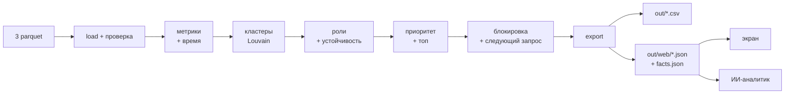

# Грибница (Mycelium) — граф денег для AML-аналитика

## 1. Что это и для кого

**Грибница** — инструмент AML-аналитика банка второго уровня. По выгрузке переводов от 81 известного
курьера она восстанавливает структуру группы: даёт роль каждому из 2 248 клиентов, делит сеть на кластеры и
строит ранжированный список «кого проверять первым» с обоснованием на числах. Аналитику не нужно знать
теорию графов: у каждой роли есть правило с порогами, а у каждого узла — объяснение «почему».

**Метафора.** Банк срывает грибы (блокирует курьеров), а они вырастают снова. Мы показываем грибницу —
сеть, на которой они растут.

## 2. Быстрый старт

> **Ключ OpenAI для проверки не нужен.** Всё, кроме живых ответов ИИ-аналитика, работает без него и без
> интернета.
>
> **Node.js не нужен.** Собранный интерфейс лежит в `web/dist/`, его раздаёт Python-сервер. Если папки
> `web/dist/` нет, по адресу `/` открывается страница-заглушка, а API и Swagger (`/docs`) работают.

Все команды — из корня репозитория.

**macOS / Linux**

```bash
python3 -m venv .venv
source .venv/bin/activate
python -m pip install -r requirements.txt
python -m mycelium.pipeline
python -m mycelium.serve
```

**Windows (PowerShell или cmd)**

```bat
py -m venv .venv
.venv\Scripts\activate
python -m pip install -r requirements.txt
python -m mycelium.pipeline
python -m mycelium.serve
```

Если PowerShell не даёт выполнить `activate` («running scripts is disabled»), выполните один раз
`Set-ExecutionPolicy -Scope CurrentUser RemoteSigned` или используйте cmd.

Откройте **http://localhost:8000** (Swagger API — http://localhost:8000/docs).

### Если порт 8000 занят

Ошибка вида `address already in use` / `Errno 48` / `Errno 10048` значит, что порт занят другой
программой. Запустите на другом порту:

```bash
python -m mycelium.serve --port 8001
```

и откройте http://localhost:8001.

## 3. Системные требования и зависимости

| | |
|---|---|
| Python | ≥ 3.9 (проверено на 3.9.6 и 3.12) |
| ОС | macOS, Linux, Windows |
| Железо | обычный ноутбук, без GPU |
| Интернет | только для установки пакетов и необязательного ИИ-аналитика |
| Время | установка ~1–2 мин; пайплайн ~10 с; сервер стартует за ~1 с |

Библиотеки (`requirements.txt`): pandas, pyarrow, numpy, networkx, fastapi, uvicorn, openai,
python-dotenv, pytest, httpx.

Ставьте пакеты только через `python -m pip` внутри активированного venv, а не голым `pip`: иначе
библиотеки могут установиться в другой Python.

## 4. Переменные окружения

**Для проверки не нужны.** Нужны только для живых ответов ИИ-аналитика. Скопируйте `.env.example` в `.env`
(`cp .env.example .env`, на Windows — `copy .env.example .env`) и заполните:

| Переменная | Обязательна для ИИ | Значение |
|---|---|---|
| `OPENAI_API_KEY` | да | ключ OpenAI API |
| `OPENAI_MODEL` | да | быстрая модель с function calling; в примере — `gpt-4.1-mini` |
| `OPENAI_BASE_URL` | нет | свой адрес совместимого API; пусто — api.openai.com |
| `OPENAI_TIMEOUT` | нет | таймаут запроса, секунд (по умолчанию 30) |

`.env` не коммитится. Без ключа `GET /api/health` отвечает `"ai_enabled": false`, `POST /api/ask` — 503
`{"error": "ai_disabled"}`, а ИИ-вкладка показывает сохранённую и сверенную справку `out/brief.md`.

## 5. Архитектура и технологии

Подробная схема и описание слоёв — в [`docs/architecture.md`](docs/architecture.md).



Бэкенд: Python, pandas, networkx, FastAPI. Пакет `mycelium/`: `load` → `features` / `temporal` →
`clusters` → `roles` → `resilience` → `priority` / `evidence` → `sankey`, `next_requests`, `layout` →
`export`. Все пороги, веса и сиды — в `mycelium/config.py`. Все случайности идут от `SEED = 42`, поэтому
два запуска подряд дают одинаковые файлы.

## 6. Проверка за 5 минут

Нужен активированный venv (раздел 2). Каждый шаг — с ожидаемым результатом.

| # | Команда / действие | Что должно получиться |
|---|---|---|
| 1 | `python -m mycelium.pipeline` | Время по шагам и таблица ролей: координаторов **8**, точек сбора **24**, распределителей **20**, транзитных **228**, конечных получателей **196**, периферии **1 772**, итого **2 248**. «Кластеров: 48», «ядро-кольцо: 85 узлов». Время ~10 с |
| 2 | `python -m mycelium.validate` | Список ✓ и последняя строка **«Всё в порядке: проверок 42, предупреждений 0»** |
| 3 | `python -m pytest -q` | **52 passed, 7 skipped** (7 живых вопросов к ИИ пропускаются без ключа). Среди них смысловые тесты `tests/test_semantics.py`: роли, обоснования, кластеры, блокировка пересчитываются независимо из `data/*.parquet`; форма всех ответов API совпадает с `docs/mock`, сверка ИИ ловит выдуманные числа и gid (тесты ИИ идут без сети) |
| 4 | `python -m mycelium.serve` (или `--port 8001`) | «Грибница: http://localhost:8000 (API: /docs)» |
| 5 | Открыть http://localhost:8000/api/health | `{"status":"ok","ai_enabled":false,...}` — без ключа ИИ выключен, это нормально |
| 6 | Открыть http://localhost:8000 → список «Кого проверять» | 30 узлов по убыванию приоритета; первые четыре — координаторы, и ни один из них не курьер |
| 7 | Найти любой gid поиском, открыть карточку, блок «Почему эта роль» | Роль, «роль устойчива в K из 50 вариантов порогов», правила по порядку с ✓/✗, значениями и порогами, плательщики и получатели |
| 8 | Взять любой gid из `out/top_nodes.csv` (или его последние 6 цифр) и выполнить `python -m mycelium.explain <gid>` | В терминале то же, что в карточке: роль, обоснование, правила ✓/✗, метрики, связи |
| 9 | http://localhost:8000/docs → `POST /api/block` с `{"ids": ["<gid из топа>"]}` | `drop_reach_pct` — на сколько процентов упал поток денег курьеров; попытка заблокировать курьера даёт 400 с объяснением |
| 10 | Открыть http://localhost:8000/api/brief | Справка по делу (markdown) и `"verified": true` — каждое число и gid в ней сверены с графом. Ключ не нужен |
| 10a | `python -m mycelium.ai.brief --check` | «✓ out/brief.md сверена с графом» — повторная сверка справки (в том числе после ручной правки) обновляет `out/brief_check.json` |
| 10b | `python -m pytest -q -m ai tests/test_ai_golden.py` *(нужен ключ)* | 7 эталонных вопросов к ИИ с известными ответами; сценарий демо — `docs/demo.md` |
| 11 | *(необязательно, нужен ключ в `.env`)* `python -m mycelium.ai.brief`, затем `POST /api/ask` с `{"question": "Кто собирает деньги с первых пяти узлов топа?"}` | Ответ с `[gid:…]`, `verified` и списком `tool_calls` — какие запросы к графу сделал ИИ |

## 7. Методология

**Метрики узла.** Число плательщиков и получателей, суммы входа и выхода, число переводов, доля пропуска
(сколько от полученного ушло дальше), медиана удержания (через сколько дней деньги уходят дальше), охват
курьеров (деньги скольких курьеров доходят до узла), посредничество (betweenness), размер кольца (сильно
связной компоненты), синхронный сбор (максимум плательщиков в один день), зависимый поток (сколько денег
курьеров перестанет двигаться, если заблокировать только этот узел).

**Роли.** Первое сработавшее правило с порогом: координатор → распределитель → точка сбора → транзит →
конечный получатель → периферия. Правила, пороги и почему они такие — в **[`ROLES.md`](ROLES.md)**.

**Устойчивость роли.** Разметки нет, поэтому роли пересчитываются 50 раз со сдвигом каждого порога на
±20 %. `role_score` — доля прогонов, где роль совпала с базовой: «роль устойчива в 49 из 50 вариантов
порогов».

**Кластеры.** Louvain на **ненаправленной** проекции графа с весом `log(1 + сумма)`. Направление переводов
при кластеризации теряется — это сознательное упрощение: кластеры отвечают на вопрос «кто с кем
связан», а роли считаются по направленному графу. Гипотеза кластера строится по шаблону.

**Приоритет проверки.** Взвешенная сумма перцентильных рангов: вес роли 0,25, зависимый поток 0,30,
посредничество 0,15, число плательщиков 0,15, оборот 0,10, устойчивость 0,05. У курьеров множитель 0,5:
они уже известны правоохранителям, ценность — в тех, кого не знают.

**Проверять и блокировать — разные задачи.** Мы сравнили, сколько денег курьеров перестаёт двигаться,
если заблокировать N не-курьеров:

| N = 10 | весь поток | до 3–4 колена |
|---|---|---|
| 10 случайных узлов | −0,9 % | −1,1 % |
| наш топ проверки | −11,3 % | −14,7 % |
| топ по обороту | −30,6 % | −43,0 % |
| **жадный план блокировки** | **−33,7 %** | **−44,9 %** |

При N = 20 план даёт −48,2 % / −63,5 %. Топ проверки ищет центры сбора и распределения (координаторы и точки
сбора), а план блокировки — узлы, через которые идут самые большие потоки. Поэтому мы выдаём **оба
списка** и не выдаём топ проверки за лучшую стратегию блокировки.

**ИИ-аналитик со сверкой.** Роли и цифры считает код, ИИ только пересказывает. Модель отвечает через
10 инструментов над посчитанными выходами (`mycelium/ai/tools.py`): карточка узла, соседи, какие курьеры
питают узел, «кто собирает деньги с этих узлов», путь денег между двумя узлами, топ, кластер, эффект
блокировки, план блокировки. После ответа код проверяет (`mycelium/ai/verify.py`): каждый `[gid:…]` есть
в графе и встречался в результатах инструментов; каждое число («3,2 млн», «33,7 %», «19») совпадает с
числом из результатов с учётом округления; нет запрещённых формулировок. Итог — значок «сверено с графом»
или честный список расхождений. Справка по делу (`python -m mycelium.ai.brief`) проходит ту же сверку; без
ключа она собирается кодом из `out/facts.json`, поэтому экран всегда показывает проверенный текст.

## 8. Что на выходе (`out/`)

| Файл | Содержимое |
|---|---|
| `nodes_roles.csv` | 2 248 строк: `gid, role, role_score, cluster_id, priority_score, evidence` + метрики узла |
| `clusters.csv` | кластер: `cluster_id, n_nodes, n_seed, sum_kzt_internal, top_gids, hypothesis` |
| `top_nodes.csv` | 30 узлов для проверки: `rank, gid, role, priority_score, why` |
| `blocking_plan.csv` | 20 шагов жадного плана блокировки: сколько ₸ отсёк каждый шаг |
| `next_requests.csv` | что запросить дальше: исходящие у узлов границы выборки, входящие у узлов с притоком вне выборки |
| `web/*.json` | данные для экрана и API (форма — `docs/mock/`) |
| `facts.json` | все посчитанные факты для ИИ-аналитика |
| `brief.md`, `brief_check.json` | справка по делу и результат её сверки с графом (`source`: `template` — без модели, `openai` — моделью) |

Финальные версии выходов закоммичены: результат виден и без запуска.

## 9. Как мы обработали ловушки данных

| Ловушка | Обработка |
|---|---|
| Обрыв на 4-м колене: 444 узла без исходящих | флаг `truncated`; такой узел никогда не транзит, не конечный получатель, не распределитель и не координатор; попадает в «Следующий запрос» |
| Настоящий сток или обрыв | узлы колен 0–3 обход раскрыл, поэтому «нет исходящих» у них — факт «деньги остались»; на 4-м колене — неизвестность |
| У курьеров занижены входящие | доля пропуска для курьеров не считается и не используется в правилах; курьер не бывает транзитом |
| 302 узла отдают больше, чем получили | флаг `inflow_outside_sample`: такой узел может быть транзитом, в обосновании — «приток вне выборки», он попадает в запрос входящих |
| Сумма и количество — разные сигналы | в обоснованиях и суммы, и число связей |
| Граф направленный | все метрики ролей направленные; Louvain — на ненаправленной проекции, это оговорено |
| 19 курьеров без рёбер | все в `nodes_roles.csv`: периферия, кластер 0 |
| Порог 5 000 ₸ | дробление ниже порога невидимо — указано в ограничениях |
| Нет разметки | вместо точности — устойчивость роли к сдвигу порогов |

## 10. Ограничения подхода

- Видны только исходящие переводы от 81 курьера на 4 колена, только внутри банка, только ≥ 5 000 ₸ и только
  за июль 2026. Межбанковские переводы, наличные и дробление ниже порога не видны.
- Роли — пороговые правила: узлы у границы порога менее устойчивы (это видно по `role_score`).
- Кластеры не учитывают направление переводов.
- Результат — гипотезы и приоритеты для проверки человеком, а не вывод о виновности. Продукт не блокирует
  счета и не обогащает данные внешними источниками.

## 11. Масштабирование до ~1 млн узлов

- Графовые вычисления — на igraph или graph-tool вместо networkx.
- Leiden вместо Louvain: быстрее и даёт связные сообщества.
- Приближённый betweenness по выборке опорных узлов.
- Охват курьеров — параллельные BFS с ограничением глубины.
- Пересчёт по компонентам и инкрементально по новым транзакциям, а не весь граф заново.
- Хранение в графовой или колоночной БД.
- Экран — агрегированный вид по кластерам и подгрузка окрестности узла по запросу вместо всего графа.

## 12. Раскрытие

Стартовый код организаторов, библиотеки, модель OpenAI и AI-инструменты разработки перечислены в
[`DISCLOSURE.md`](DISCLOSURE.md).
