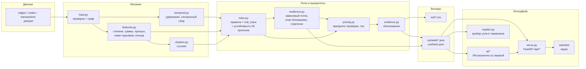

# Архитектура «Грибницы»: данные → метрики → роли → интерфейс

| Слой | Модули | Что происходит |
|---|---|---|
| Данные | `load.py` | чтение трёх parquet, проверка консистентности (транзакции складываются в рёбра, нет чужих gid), направленный граф со всеми 2 248 узлами |
| Метрики | `features.py`, `temporal.py`, `clusters.py` | направленные метрики узла (§7 CLAUDE.md), удержание денег по датам переводов, кластеры Louvain на ненаправленной проекции |
| Роли | `roles.py`, `config.py` | роль = первое сработавшее правило с порогами из `config.py`; `rule_trace` строится из тех же правил; устойчивость — 50 прогонов со сдвигом порогов ±20 % |
| Приоритеты | `resilience.py`, `priority.py`, `next_requests.py`, `sankey.py` | зависимый поток (что сломается при блокировке узла), жадный план блокировки, сравнение стратегий; приоритет проверки; что запросить дальше; «лестница денег» |
| Тексты | `evidence.py` | обоснования ≤ 200 символов с числами, только язык гипотез |
| Выходы | `export.py`, `layout.py` | CSV по контракту кейса, JSON для API в форме `docs/mock`, `facts.json` для ИИ; проверка контрактов перед записью |
| Интерфейс | `serve.py`, `web/dist`, `ai/*`, `explain.py` | API и раздача собранного экрана; ИИ-аналитик пересказывает только посчитанные факты и сверяется с графом; разбор узла в терминале |

Проверки: `validate.py` (контракты §16, совпадение ролей с эталоном `explore.py`), `tests/` (форма ответов API = моки).
