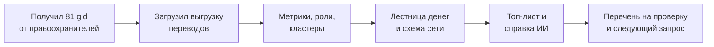

# Трасса — бизнес-видение проекта

Sep 23, 2026 · @Someone

## Суть проекта

**Трасса** (рабочее название) — инструмент AML-аналитика банка, который по графу переводов восстанавливает структуру преступной группы: кто собирает деньги, через кого их прогоняют и кто ими распоряжается.

**Обещание:** из 81 известного курьера за минуты получаем ранжированный список узлов, на которых держится сеть. По каждому есть обоснование, а ценность списка доказывается симуляцией блокировки.

Продукт отвечает на один вопрос аналитика: **«кого из 2 248 клиентов смотреть первым и почему»**.

## Проблема

Сегодня банк видит только нижний уровень сети, то есть курьеров, и блокирует именно их. Организаторы заменяют курьеров за дни, а их инфраструктура остаётся нетронутой.

| Как сейчас | Последствие |
| --- | --- |
| Цепочку от одного клиента на 4 колена трассируют вручную | часы работы аналитика на один узел |
| Известен 81 клиент, а реальная сеть — 2 248 узлов | основная часть сети невидима |
| Блокируется только нижний уровень | организаторы восстанавливают сеть за дни |
| Кого проверять первым, решают интуитивно | нет ранжирования и обоснований |

Корень проблемы не в нехватке данных. Человек физически не может прочитать структуру группы из тысяч переводов.

## Пользователь и сценарий

**Основной пользователь:** AML-аналитик, специалист подразделения финансового мониторинга банка второго уровня. Работает с данными каждый день, но не обязан разбираться в теории графов или ML.

**Вторичный пользователь (наша гипотеза):** руководитель подразделения. Ему нужна короткая справка, чтобы принять решение о запросе в правоохранительные органы.

Весь путь от загрузки файлов до готового перечня занимает минуты, а не недели.

## Ценность и эффект

Аналитик тратит минуты вместо недель, а фокус проверки смещается с легко заменяемых курьеров на точки, которые сети трудно заменить.

| Для кого | Эффект |
| --- | --- |
| Аналитик | минуты вместо недель ручной трассировки; готовые обоснования для отчёта |
| Подразделение финмониторинга | приоритеты вместо интуиции; одинаковый воспроизводимый результат у любого сотрудника |
| Банк | блокирует узлы, на которых держится сеть, а не одноразовых курьеров; знает, какие данные запросить дальше |
| Правоохранительные органы | получают запрос со структурой сети и гипотезами по ролям, а не голый список клиентов |

**Как измеряем на демо:** сколько курьеров теряют связь с точками консолидации, если заблокировать наш топ-10. Сравниваем с 10 случайными узлами и с топ-10 по обороту. Конкретные цифры получим на данных.

## Решение: обязательная часть

Одна команда превращает три сырых файла в роли, кластеры, топ-лист и экран просмотра. Это закрывает все пять must-have кейса.

1. **Пайплайн одной командой.** От файлов .parquet до трёх CSV меньше чем за 5 минут на обычном ноутбуке, без облака и без интернета.
2. **Роль у каждого из 2 248 узлов.** Точка консолидации, транзит, распределитель, конечный получатель, координатор или периферия. Роль определяется простым правилом с порогом, к ней прилагаются уверенность и обоснование текстом.
3. **Объяснимые правила.** Все правила собраны в одном документе, поэтому любой узел объясняется за минуту.
4. **Кластеры.** Сеть разбита на группы; по каждой видны размер, число курьеров, оборот и гипотеза о назначении.
5. **Топ-лист и экран.** Не менее 20 узлов с обоснованием, схема сети со стрелками потоков, цвета ролей, поиск по gid и карточка узла.

**Главная метрика — охват курьеров:** деньги скольких из 81 курьера доходят до узла по цепочке. Фраза «сюда стекаются деньги 14 курьеров» понятна любому аналитику без пояснений.

**Две ловушки данных обрабатываем явно:**

- **Обрыв на 4-м колене.** 444 узла без исходящих переводов не записываем в конечных получателей: мы просто не видим, куда деньги ушли дальше.
- **Seed-клиенты.** Их входящие суммы занижены, поэтому соотношение «отдал / получил» для них не считаем.

## Отличительные возможности

Обязательную часть сделают многие команды. Выделяют нас пять возможностей: каждая либо делает результат понятным без технического образования, либо доказывает, что ему можно верить.

### Делаем обязательно

| Возможность | Что видит пользователь | Зачем |
| --- | --- | --- |
| ИИ-аналитик со сверкой | справка по делу простым языком; gid в тексте кликабельны; значок «сверено с графом» | понятно нетехническому жюри и руководителю; нет выдуманных фактов |
| Лестница денег | диаграмма потоков: от курьеров через транзит к точкам консолидации, толщина ленты равна сумме | вся схема группы понятна за 5 секунд |
| Блокировка кликом | кликаешь по узлу, он гаснет, счётчик показывает, сколько курьеров потеряли связь с верхушкой | судья сам убеждается, что наш топ важнее случайных узлов |
| Устойчивость роли | «консолидатор в 49 из 50 вариантов порогов» | честный ответ на то, что правильной разметки нет |
| Следующий запрос | список узлов, где сеть обрывается на самом интересном месте | готовое действие для аналитика после анализа |

**Как работает ИИ-аналитик.** Роли и цифры считает код, а ИИ получает только готовые факты и пересказывает их простым языком. После генерации код сверяет каждый gid и каждую цифру в тексте с данными. Справка сохраняется заранее, поэтому работает и без API-ключа.

### Если успеваем

- **Проигрывание июля по дням:** переводы вспыхивают на схеме в день, когда произошли, и видно волны сбора выручки.
- **Кольца и синхронные сборы:** деньги вернулись к исходному отправителю или несколько плательщиков перевели одному получателю в один день. Это добавляется в обоснования ролей и в справку.

## Принципы продукта

Продукт помогает человеку решить, кого проверять, но сам никого не обвиняет.

- **Гипотезы, а не обвинения.** Пишем «признаки консолидации», «рекомендуем проверить». Никогда не пишем «преступник», «организатор», «украл».
- **Объяснимость.** Каждая роль — это правило с порогом, каждая позиция в топе сопровождается текстом «почему».
- **ИИ пересказывает, а не решает.** Роли считает код, ИИ получает только посчитанные факты, его текст сверяется с графом.
- **Только данные из выгрузки.** Никаких внешних источников и придуманных атрибутов вроде пола, возраста или дохода.
- **Приватность.** Работаем только с обезличенными gid, никаких ФИО и ИИН.
- **Работает локально.** Без облака, GPU и платных сервисов. Без API-ключа отключается только ИИ-часть, а сохранённая справка остаётся.

## Чего продукт не делает

- Не выносит вердикт о виновности и не блокирует счета: выдаёт приоритеты и гипотезы, решение принимает человек.
- Не обогащает данные внешними источниками.
- Не работает в реальном времени: обрабатывает разовую выгрузку.
- Не использует для ролей ML-модели, которые нельзя объяснить.
- Не видит переводы меньше 5 000 ₸ и межбанковские переводы. Это ограничение исходных данных, и мы указываем его в выводах.

## Критерии успеха на хакатоне

Цель — финал. Для этого все must-have должны работать по README на чистой машине, а на демо жюри должно само убедиться в ценности нашего ранжирования.

| Критерий технического отбора | Баллы | Чем закрываем |
| --- | --- | --- |
| Соответствие задаче и работоспособность | 25 | все пять must-have, проверенные по списку из кейса |
| Техническая реализация | 25 | учёт ловушек данных, устойчивость ролей, ИИ-аналитик со сверкой |
| README и воспроизводимость | 25 | запуск одной командой, проверка из чистого клона, раздел про рост до \~1 млн узлов |
| Ценность и применимость | 15 | блокировка кликом, следующий запрос |
| Потенциал и оригинальность | 10 | устойчивость ролей, сверка ответов ИИ с графом |

На Demo Day главные критерии — ценность решения (25) и потенциал развития (20). Их закрывают лестница денег, справка ИИ и блокировка кликом.

**Правило приоритетов:** до 15:30 делаем только must-have. Отличительные фичи начинаем, когда все пять обязательных пунктов работают. Финальный коммит — в 17:45.

## Потенциал развития

Подход не привязан к наркотикам: тот же набор ролей описывает любую сеть, где деньги собирают, прогоняют и выводят.

- **Другие схемы.** Дропы в мошенничестве, обнал, выручка нелегальных онлайн-казино: те же точки сбора, транзит и веерная раздача.
- **Встраивание в банк.** Модуль приоритизации внутри существующей AML-системы банка, а не отдельный инструмент.
- **Масштаб.** При росте до \~1 млн узлов переходим на графовую базу данных и пересчитываем только изменившиеся части сети. На хакатоне описываем это текстом в README.
- **Уровень регулятора.** Общий граф по нескольким банкам на уровне АФМ закроет слепое пятно межбанковских переводов. Для этого нужна правовая основа, поэтому это долгосрочное направление.
- **Модель (гипотеза).** Лицензия или подписка для банков второго уровня.

## Открытые вопросы

- [ ] Финальное название продукта
- [ ] Обрыв на 4-м колене: отдельная роль `truncated` или `peripheral` с пометкой в обосновании
- [ ] Кто из двух других участников берёт экран, а кто кластеры и симуляцию блокировки
- [ ] Какую модель использовать для ИИ-аналитика (есть кредиты OpenAI из пакета участника)
- [ ] Нужны ли к сдаче видео-демо и презентация: проверить в условиях кейса на платформе
